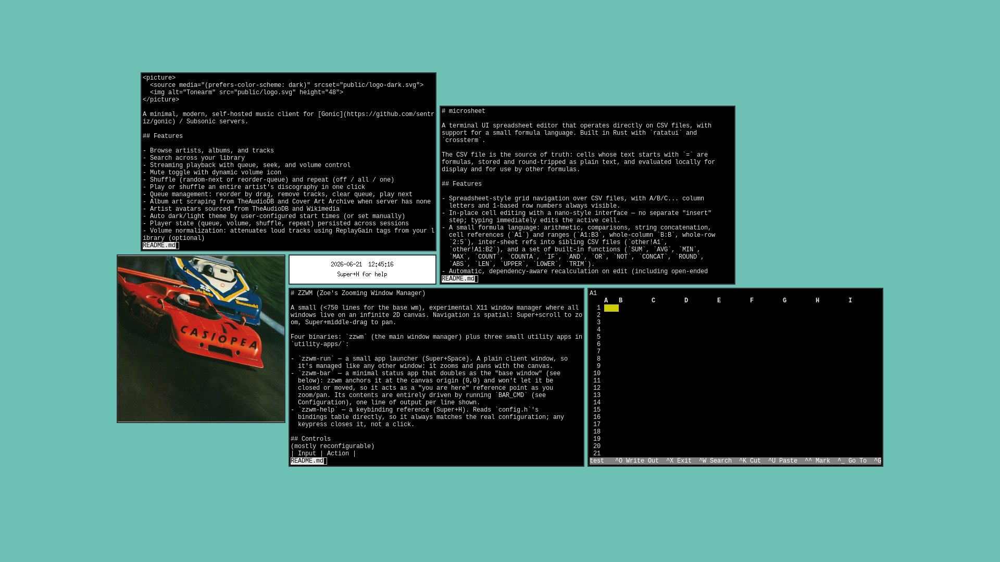

# ZZWM (Zoe's Zooming Window Manager)

A small (<750 lines for the base wm), experimental X11 window manager where all windows live on an infinite 2D canvas. Navigation is spatial: Super+scroll to zoom, Super+middle-drag to pan.



Four binaries: `zzwm` (the main window manager) plus three small utility apps in
`utility-apps/`:

- `zzwm-run` — a small app launcher (Super+Space). A plain client window, so
  it's managed like any other window: it zooms and pans with the canvas.
- `zzwm-bar` — a minimal status app that doubles as the "base window" (see
  below): zzwm anchors it at the canvas origin (0,0) and won't let it be
  closed or moved, so it acts as a "you are here" reference point as you
  zoom/pan. Its contents are entirely driven by running `BAR_CMD` (see
  Configuration), one line of output per line shown.
- `zzwm-help` — a keybinding reference (Super+H). Reads `config.h`'s
  bindings table directly, so it always matches the real configuration; any
  keypress closes it, not a click.

## Controls
(mostly reconfigurable)
| Input | Action |
|---|---|
| Super + Scroll wheel | Zoom in / out, centred on cursor |
| Super + Middle-click drag | Pan the canvas |
| Left-click window | Focus (and raise to top) |
| Super + left-drag | Move window on canvas (no-op on the base window; snaps to other windows' edges, see Configuration) |
| Super + right-drag | Resize window (also snaps) |
| Super + Return | Spawn xterm |
| Super + Space | Spawn zzwm-run (type a command, Enter to launch) |
| Super + H | Spawn zzwm-help (keybinding reference) |
| Super + Q | Close focused window (no-op on the base window) |

## Configuration

Edit `config.h` and rebuild to change functionality:

- `ANCHOR_NAME` — the X window name (`WM_NAME`/`XStoreName`) of the "base
  window". Whatever window has this name is anchored at the canvas origin
  instead of the viewport, and can't be closed or moved. Defaults to
  `"zzwm-bar"`, matching `utility-apps/statusbar.c`.
- Keybindings — each line is `BIND(modifier, keysym, action, arg)`, e.g.
  `BIND(Mod4Mask, XK_Return, ACT_SPAWN, "xterm &")`. Available actions:
  `ACT_SPAWN` (run `arg` as a shell command), `ACT_CLOSE` (close the focused
  window).
- `SNAP_ENABLED` — set to `0` to disable edge snapping entirely. Default `1`.
- `SNAP_DIST` — how close (in canvas/native pixels, independent of zoom) an
  edge has to get to another window's edge before it snaps. Default `12`.
- `SNAP_GAP` — space (same units) left between two windows when they snap
  side-by-side instead of sitting flush. Default `10`.
- `BAR_CMD` — a shell command; each line of its output becomes one centred
  line in zzwm-bar (window resizes to fit), re-run every `BAR_CMD_INTERVAL`
  seconds. Defaults to a one-liner that prints a clock and a help hint.
- `BAR_CMD_INTERVAL` — how often `BAR_CMD` is re-run, in seconds. Default `1`.

No changes to `zzwm.c` are needed for either.

Edit `appearance.h` and rebuild to change aesthetics:

- `CANVAS_BG_*` — zzwm's canvas background, behind all windows. Dark navy
  by default.
- `BG_*`/`FG_*`/`DIM_*` — background, foreground, and dim text for
  `zzwm-run`, `zzwm-bar`, and `zzwm-help`. Background is white by default.
- `BORDER_R`/`BORDER_G`/`BORDER_B` — color of the border drawn around every
  managed window.
- `BORDER_THICKNESS` — border thickness in canvas pixels at zoom 1.0 (it
  scales with the window as you zoom). Set to `0` to disable borders.
- `FONT_NAME` — X font name (`XLoadQueryFont`) used by zzwm-run and
  zzwm-bar. Default `"fixed"`.

No changes to any `.c` files are needed.

## Building and running

```sh
make
```

Requires: `libX11`, `libXrender`, `libXcomposite`, `libXdamage`, '`libXoresent`, and `libXInput`.

```sh
# Debian/Ubuntu:
apt install libx11-dev libxrender-dev libxcomposite-dev libxdamage-dev libxpresent-dev libxi-dev xserver-xephyr
```

Always test inside a nested X server:

```sh
Xephyr :1 -screen 1280x800 &
DISPLAY=:1 ./zzwm &
DISPLAY=:1 ./zzwm-bar &
```

Then open windows on `:1`:

```sh
DISPLAY=:1 xterm &
```

## Installation

```sh
make
sudo make install         # installs to /usr/local/bin
# or, without root:
make install PREFIX=~/.local
```

`zzwm` launches `zzwm-run`/`zzwm-bar`/`zzwm-help` via `system()` (e.g.
`"zzwm-run &"`), so they must be on `$PATH` for keybindings like Super+Space
to work — `make install` puts all four binaries plus `startZZWM.sh` in the
same directory for that reason. `make install` also installs `zzwm.desktop`
to `/usr/share/xsessions` (independent of `PREFIX`, since that's the fixed
location display managers scan), so ZZWM shows up as a session choice on
your login screen. `make uninstall` removes all of it again (respects the
same `PREFIX`/`DESTDIR`).

To start ZZWM via a display manager (GDM, LightDM, SDDM, etc.), just select
the "ZZWM Session" entry at the login screen after `sudo make install`.

To run zzwm as your actual X session window manager without a display
manager, add to `~/.xinitrc`:

```sh
zzwm-bar &
exec zzwm
```

then start X with `startx`. (Test in Xephyr first, per above — zzwm replaces
whatever WM is currently running on the display, so a bad keybinding config
could leave you without a way to spawn a terminal.)

## License

MIT — see [LICENSE](LICENSE).
